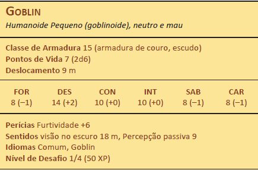
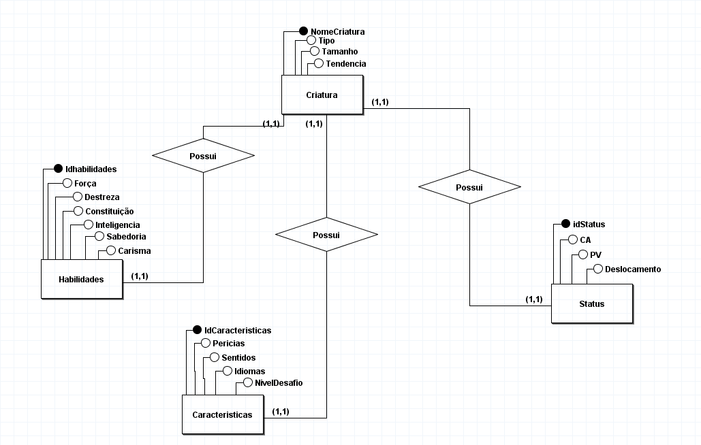
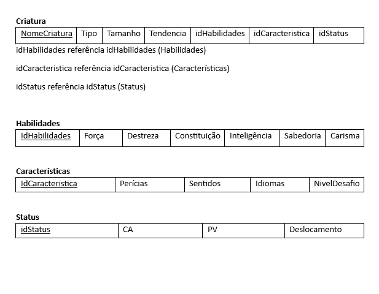
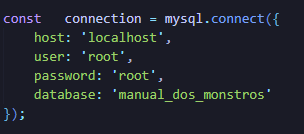

# Manual dos Monstros WEB
Repositorio destinado para o armazenamento do projeto prático desenvolvido no curso de Banco de Dados I (CSI 440)
## Projeto desenvolvido por: Arthur Wolff Soares

---

# Sumario:

1. [Descrição do Problema](https://github.com/arthur-wolff/Banco-de-Dados-I/tree/main#descri%C3%A7%C3%A3o-do-problema)
2. [Criação do Banco de Dados](https://github.com/arthur-wolff/Banco-de-Dados-I/tree/main#cria%C3%A7%C3%A3o-do-banco-de-dados)
3. [Execução da Aplicação](https://github.com/arthur-wolff/Banco-de-Dados-I/tree/main#execu%C3%A7%C3%A3o-da-aplica%C3%A7%C3%A3o)


---

# Descrição do Problema:

A aplicação tem como principal objetivo auxiliar a consulta de dados básicos dos monstros descritos no Manual dos Monstros da 5 edição de Dungeons and Dragons

Os dados armazenados seguiram esse padrão:



## Regras de Negocio
Onde: 
  1. Cada monstro é identificado por seu nome;
  2. Caso o monstro não possua o atributo em questão deve ser utilizado “-” no preenchimento do dado; 
  3. O preenchimento de dados devem respeitar a formatação apresentada no livro;
  4. Os dados ‘pontos de vida’ devem ser preenchidos apenas pelos dados dentro dos parênteses e os  dados de ‘classe de armadura’ apenas a parte inteira;


---

# Criação do Banco de Dados:
## Modelagem ER:
O banco foi modelado da sequinte forma:



## Modelo Relacional:
O mapeamento para o modelo relacional se deu da seguinte forma:



## Script de Criação do Banco:
Dado o mapeamento o seguinte Script de criação do Banco foi criado:

[SCRIPT DE CRIAÇÂO DO BANCO DE DADOS](db/Modelagens_BD_Trab_Pratico/Scripts_DB/Script_criação_do_banco.sql)

## Script de Povoamento do Banco:
O Banco foi populado apartir do seguinte script:

[SCRIPT DE POVOAMENTO DO BANCO DE DADOS](db/Modelagens_BD_Trab_Pratico/Scripts_DB/Script_Povoar_Banco.sql)


---

# Execução da Aplicação:
Para a execução do programa é necessário:

## Criar/Popular o Banco:
É necessário a criação do banco de dados a partir do [SCRIPT DE CRIAÇÂO DO BANCO DE DADOS](db/Modelagens_BD_Trab_Pratico/Scripts_DB/Script_criação_do_banco.sql)
e também o povoamento do banco a partir do [SCRIPT DE POVOAMENTO DO BANCO DE DADOS](db/Modelagens_BD_Trab_Pratico/Scripts_DB/Script_Povoar_Banco.sql)

É importante resaltar que a aplicação foi desenvolvida utilizando o MYSQL como SGBD, sendo assim ela está programada para responder a esse SGBD dado o uso da biblioteca [mysql2](https://www.npmjs.com/package/mysql2) e a seguinte configuração: 



Caso necessário esses campos devem ser alterados, levando em conta as configurações utilizadas na maquina.


## Node.js:
É necessário a instalação do [Node.js](https://nodejs.org/en)

## Instalar Depedencias:
É necessário realizar a instalação das depedencias do programa, para isso no terminal insira:

```npm install```


## Iniciar o Backend:
É necessário iniciar a API de backend, para isso no terminal insira:

```npm start```

## Abrir a Pagina:
Abra a pagina ```index.html```

## Realize a Busca:
Digite o nome da criatura a ser buscada, levando em conta aquelas que estão povoando o banco de dados: 

[Lista de criaturas que povoam o Banco de Dados](https://github.com/arthur-wolff/Banco-de-Dados-I/blob/4ac8a1480aff1780889aafd84eb5b972c06bc8c7/Criaturas%20no%20Banco%20de%20dados.txt)

---


